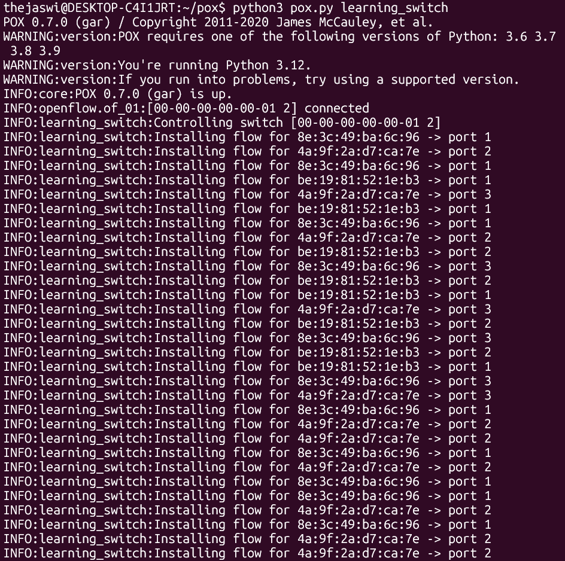
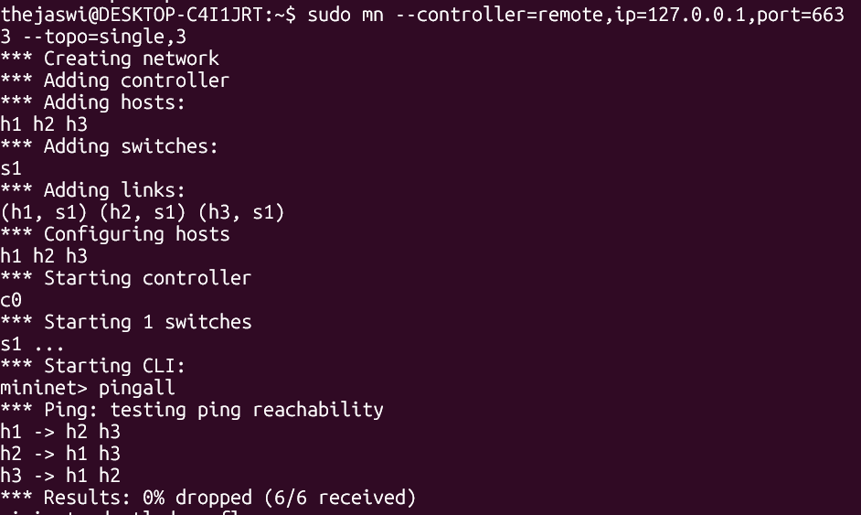
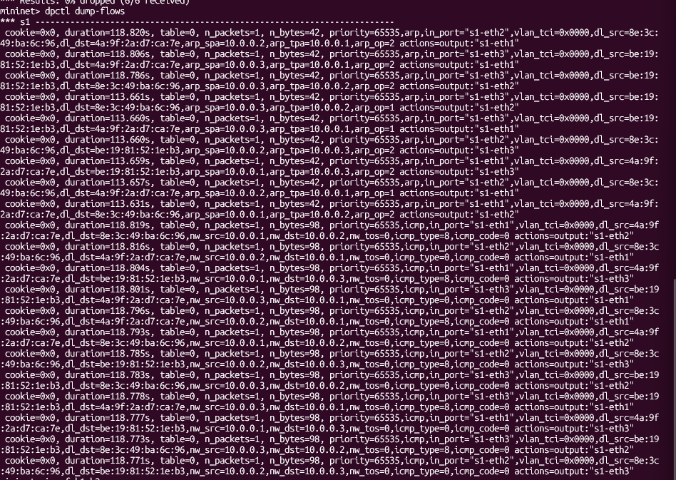
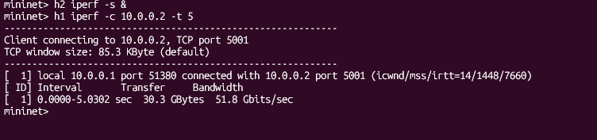
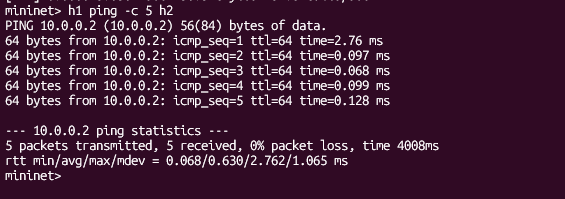
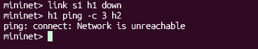

# SDN Learning Switch Controller implementation

## 1. Project Overview
This repository contains the implementation of a **Layer 2 Learning Switch** using the **POX SDN Controller** and **Mininet**. The project demonstrates the core principles of Software-Defined Networking (SDN) by separating the control logic from the data forwarding plane.

## 2. Problem Statement
The goal is to implement a controller that dynamically mimics the behavior of a physical learning switch. Instead of flooding all ports, the controller:
* Learns the source MAC address and its arrival port.
* Installs a flow rule in the switch for future packets.
* Ensures efficient point-to-point communication.

## 3. Project Expectations & Proof
Based on the project requirements, the following features were implemented and validated:

### A. MAC Address Learning Logic & Dynamic Flow Installation
The controller monitors `PacketIn` events to map MAC addresses to ports and pushes flow rules to the switch.


### B. Packet Forwarding Validation
Connectivity was tested using `pingall` to ensure the learning logic allows all hosts to communicate.


### C. Flow Table Inspection
We verified the hardware state of the switch to ensure match-action rules were installed.


## 4. Performance Observation & Analysis
Testing was conducted on a `single,3` topology to measure the efficiency of the SDN implementation.

| Metric | Result |
| :--- | :--- |
| **Throughput (iperf)** | **51.8 Gbits/sec** |
| **Average Latency (ping)** | **0.630 ms** |
| **Packet Loss** | **0%** |

**Throughput Proof:**



**Latency Proof:**



**Analysis:**
The first ping in each session (e.g., **2.76 ms**) is significantly higher than subsequent pings (**~0.09 ms**). This proves that the first packet is handled by the **Control Plane** (POX), while all following packets are handled at wire-speed by the **Data Plane** (Switch).

## 5. Test Scenarios
1.  **Normal Scenario:** Full connectivity verified via `pingall`.
2.  **Failure Scenario:** The link was manually disabled (`link s1 h1 down`) to observe network responsiveness.




## 6. How to Run
1.  Run the POX controller:
    ```bash
    python3 pox.py learning_switch
    ```
2.  Start the Mininet topology:
    ```bash
    sudo mn --controller=remote,ip=127.0.0.1,port=6633 --topo=single,3
    ```

---
*Developed for the SDN Individual Project (PES1UG23CS655)*
